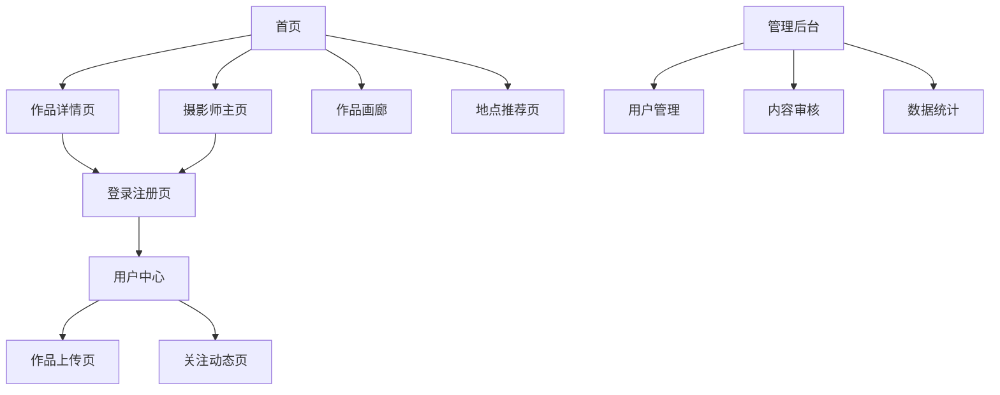

# 摄影交流平台产品需求文档

## 1. Product Overview

本项目是一个专业的摄影作品展示与交流平台，旨在为摄影师提供作品展示、技术交流和社区互动的综合性服务。平台支持高质量照片上传、分类管理、社交互动等核心功能，帮助摄影师建立个人品牌并与同行交流学习。

目标是打造国内领先的摄影师社区平台，连接专业摄影师与摄影爱好者，促进摄影技术传播和作品商业化。

## 2. Core Features

### 2.1 User Roles

| Role | Registration Method | Core Permissions |
|------|---------------------|------------------|
| 普通用户 | 邮箱注册 | 浏览作品、点赞评论、关注摄影师 |
| 摄影师用户 | 邮箱注册+作品认证 | 上传作品、管理个人主页、查看数据统计 |
| 管理员 | 系统分配 | 用户管理、内容审核、平台数据管理 |

### 2.2 Feature Module

我们的摄影交流平台包含以下主要页面：

1. **首页**: 精选作品展示、摄影师推荐、热门地点推荐、分类导航
2. **作品详情页**: 作品大图展示、拍摄参数、评论互动、相关推荐
3. **摄影师主页**: 个人信息展示、作品集、关注数据、联系方式
4. **作品上传页**: 批量上传、信息编辑、分类标签、发布管理
5. **用户中心**: 个人资料管理、作品管理、关注列表、数据统计
6. **登录注册页**: 用户认证、密码管理、第三方登录
7. **作品画廊**: 分类浏览、搜索筛选、排序展示
8. **地点推荐页**: 拍摄地点介绍、最佳时间、难度评级、作品展示
9. **关注动态页**: 关注摄影师动态、新作品推送
10. **管理后台**: 用户管理、内容审核、数据统计、系统配置

### 2.3 Page Details

| Page Name | Module Name | Feature description |
|-----------|-------------|---------------------|
| 首页 | 精选作品轮播 | 展示平台优质作品，支持自动轮播和手动切换 |
| 首页 | 摄影师推荐 | 展示热门摄影师卡片，包含头像、姓名、作品数、关注数 |
| 首页 | 热门地点 | 展示推荐拍摄地点，包含地点图片、名称、描述 |
| 首页 | 分类导航 | 按摄影类型分类浏览，如人像、风光、建筑等 |
| 作品详情页 | 作品展示 | 高清大图展示，支持缩放、全屏查看 |
| 作品详情页 | 拍摄信息 | 显示相机型号、镜头、光圈、快门、ISO等参数 |
| 作品详情页 | 互动功能 | 点赞、收藏、评论、分享功能 |
| 作品详情页 | 相关推荐 | 推荐同类型或同摄影师的其他作品 |
| 摄影师主页 | 个人信息 | 头像、姓名、简介、专长、地区、联系方式 |
| 摄影师主页 | 作品展示 | 网格布局展示所有作品，支持分类筛选 |
| 摄影师主页 | 数据统计 | 作品数量、总点赞数、总浏览数、粉丝数 |
| 摄影师主页 | 关注功能 | 关注/取消关注按钮，关注列表管理 |
| 作品上传页 | 文件上传 | 支持拖拽上传、批量选择，最多10张 |
| 作品上传页 | 信息编辑 | 标题、描述、分类、地点、标签编辑 |
| 作品上传页 | 参数录入 | 相机、镜头、光圈、快门、ISO等拍摄参数 |
| 作品上传页 | 发布管理 | 预览、保存草稿、立即发布功能 |
| 用户中心 | 资料管理 | 修改头像、姓名、简介、专长、联系方式 |
| 用户中心 | 作品管理 | 查看、编辑、删除已发布作品 |
| 用户中心 | 关注管理 | 查看关注列表、粉丝列表、取消关注 |
| 用户中心 | 数据统计 | 个人作品数据分析、浏览趋势图表 |
| 登录注册页 | 用户认证 | 邮箱密码登录、注册、密码重置 |
| 登录注册页 | 表单验证 | 实时验证邮箱格式、密码强度 |
| 登录注册页 | 演示账号 | 提供演示账号快速体验 |
| 作品画廊 | 分类浏览 | 按摄影类型、时间、热度等维度筛选 |
| 作品画廊 | 搜索功能 | 关键词搜索作品标题、标签、摄影师 |
| 作品画廊 | 瀑布流展示 | 响应式网格布局，无限滚动加载 |
| 地点推荐页 | 地点信息 | 地点名称、图片、详细描述、最佳拍摄时间 |
| 地点推荐页 | 难度评级 | 拍摄难度标识、交通便利性、设备要求 |
| 地点推荐页 | 作品展示 | 该地点的优秀摄影作品展示 |
| 关注动态页 | 动态流 | 时间线展示关注摄影师的最新作品 |
| 关注动态页 | 互动功能 | 快速点赞、评论、转发功能 |
| 管理后台 | 用户管理 | 用户列表、权限管理、账号状态控制 |
| 管理后台 | 内容审核 | 作品审核、评论管理、举报处理 |
| 管理后台 | 数据统计 | 平台用户数、作品数、活跃度等统计图表 |

## 3. Core Process

### 普通用户流程
用户访问首页浏览精选作品 → 点击感兴趣的作品进入详情页 → 查看作品信息和摄影师资料 → 注册登录后可以点赞评论 → 关注喜欢的摄影师 → 在关注动态页查看最新作品

### 摄影师用户流程
摄影师注册登录 → 完善个人资料和专长信息 → 上传作品并填写详细信息 → 管理个人主页和作品展示 → 查看作品数据统计 → 与粉丝互动回复评论

### 管理员流程
管理员登录后台 → 审核新注册用户和上传作品 → 处理用户举报和违规内容 → 查看平台运营数据 → 管理推荐内容和热门作品

## 4. User Interface Design

### 4.1 Design Style

- **主色调**: 深蓝色 (#1e40af) 和白色，体现专业性和简洁感
- **辅助色**: 灰色系 (#6b7280, #f3f4f6) 用于背景和次要信息
- **按钮样式**: 圆角矩形按钮，主要按钮使用蓝色背景，次要按钮使用边框样式
- **字体**: 系统默认字体，标题使用 font-bold，正文使用 font-medium
- **布局风格**: 卡片式设计，网格布局，响应式设计
- **图标风格**: 使用 Lucide React 图标库，线性风格图标

### 4.2 Page Design Overview

| Page Name | Module Name | UI Elements |
|-----------|-------------|-------------|
| 首页 | 精选作品轮播 | 全屏轮播组件，渐变遮罩，白色标题文字，自动播放指示器 |
| 首页 | 摄影师推荐 | 圆形头像，卡片式布局，阴影效果，悬停动画 |
| 首页 | 热门地点 | 矩形卡片，图片背景，渐变文字遮罩，网格布局 |
| 作品详情页 | 作品展示 | 居中大图，黑色背景，缩放控制按钮，全屏模式 |
| 作品详情页 | 拍摄信息 | 表格式布局，图标+文字，浅灰背景卡片 |
| 作品详情页 | 互动功能 | 圆形按钮，红色点赞，蓝色评论，数字统计 |
| 摄影师主页 | 个人信息 | 大头像，渐变背景，白色文字，标签式专长展示 |
| 摄影师主页 | 作品展示 | 瀑布流布局，悬停放大效果，加载动画 |
| 作品上传页 | 文件上传 | 虚线边框拖拽区域，上传图标，进度条显示 |
| 作品上传页 | 信息编辑 | 表单布局，输入框聚焦效果，标签选择器 |
| 用户中心 | 导航菜单 | 侧边栏导航，激活状态高亮，图标+文字 |
| 登录注册页 | 表单设计 | 居中卡片，输入框图标，密码显示切换，蓝色主按钮 |
| 作品画廊 | 筛选器 | 顶部筛选栏，下拉选择器，搜索框，清除按钮 |
| 管理后台 | 数据图表 | 现代化图表组件，蓝色主题，响应式表格 |

### 4.3 Responsiveness

平台采用移动优先的响应式设计，支持桌面端、平板和手机端访问。桌面端以网格布局为主，移动端优化为单列布局，支持触摸手势操作如滑动、缩放等。