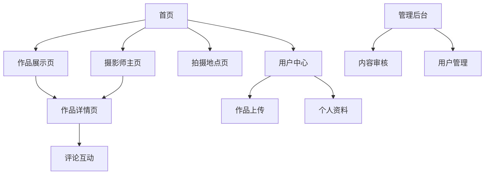

# 摄影交流平台产品需求文档

## 1. 产品概述

纯粹影像工作室摄影交流平台是一个专业的摄影作品展示与交流网站，为摄影师提供作品展示、经验分享和合作交流的平台。

该平台解决摄影师作品展示难、交流渠道少、合作机会缺乏等问题，服务于专业摄影师、摄影爱好者和摄影工作室。

目标是打造国内领先的摄影师社区平台，促进摄影行业的交流与发展。

## 2. 核心功能

### 2.1 用户角色

| 角色 | 注册方式 | 核心权限 |
|------|----------|----------|
| 普通用户 | 邮箱注册 | 浏览作品、评论、收藏 |
| 摄影师 | 邮箱注册+作品认证 | 上传作品、管理个人主页、参与合作 |
| 管理员 | 系统分配 | 内容审核、用户管理、数据统计 |

### 2.2 功能模块

我们的摄影交流平台包含以下主要页面：

1. **首页**：轮播展示、热门作品、分类导航、拍摄地点推荐
2. **作品展示页**：分类浏览、搜索筛选、作品列表
3. **作品详情页**：高清展示、拍摄参数、摄影师信息、评论互动
4. **摄影师主页**：个人简介、作品集、合作信息
5. **拍摄地点页**：地点介绍、相关作品、攻略分享
6. **用户中心**：个人资料、作品管理、收藏夹、消息通知
7. **管理后台**：内容审核、用户管理、数据分析

### 2.3 页面详情

| 页面名称 | 模块名称 | 功能描述 |
|----------|----------|----------|
| 首页 | 轮播展示 | 展示精选摄影作品，支持自动切换和手动控制 |
| 首页 | 分类导航 | 按自然、人物、建筑、城市等分类快速浏览作品 |
| 首页 | 热门地点 | 展示热门拍摄地点，点击查看相关作品和攻略 |
| 作品展示页 | 作品列表 | 网格布局展示作品缩略图，支持分页加载 |
| 作品展示页 | 筛选搜索 | 按分类、设备、摄影师、时间等条件筛选作品 |
| 作品详情页 | 高清展示 | 大图展示作品，支持缩放和全屏查看 |
| 作品详情页 | 拍摄信息 | 显示相机型号、镜头、光圈、快门、ISO等参数 |
| 作品详情页 | 摄影师信息 | 展示摄影师头像、姓名、简介和其他作品 |
| 作品详情页 | 评论系统 | 用户评论、点赞、回复功能 |
| 摄影师主页 | 个人简介 | 摄影师介绍、联系方式、合作意向 |
| 摄影师主页 | 作品集 | 展示摄影师所有作品，支持分类查看 |
| 拍摄地点页 | 地点详情 | 地点介绍、最佳拍摄时间、交通信息 |
| 拍摄地点页 | 相关作品 | 该地点的优秀摄影作品展示 |
| 用户中心 | 作品上传 | 支持批量上传，填写作品信息和拍摄参数 |
| 用户中心 | 个人资料 | 编辑个人信息、头像、联系方式 |
| 用户中心 | 收藏管理 | 管理收藏的作品和摄影师 |
| 管理后台 | 内容审核 | 审核用户上传的作品和评论内容 |
| 管理后台 | 用户管理 | 管理用户账户、权限分配 |
| 管理后台 | 数据统计 | 查看网站访问量、用户活跃度等数据 |

## 3. 核心流程

**普通用户流程：**
访问首页 → 浏览作品分类 → 查看作品详情 → 评论互动 → 关注摄影师 → 收藏作品

**摄影师流程：**
注册认证 → 完善个人资料 → 上传作品 → 填写拍摄信息 → 管理作品集 → 接受合作邀请

**管理员流程：**
登录后台 → 审核待发布内容 → 处理用户举报 → 管理用户权限 → 查看数据报表

## 4. 用户界面设计

### 4.1 设计风格

- **主色调**：黑色(#000000)、白色(#FFFFFF)
- **辅助色**：矢车菊蓝(#6495ED)、天蓝色(#00BFFF)
- **按钮样式**：圆角矩形，悬停效果
- **字体**：仿宋体(FangSong)用于标题，Arial用于正文
- **布局风格**：网格布局，卡片式设计，顶部导航
- **图标风格**：简约线性图标，支持悬停动画

### 4.2 页面设计概览

| 页面名称 | 模块名称 | UI元素 |
|----------|----------|--------|
| 首页 | 轮播展示 | 全屏轮播图，底部圆点导航，2秒自动切换，支持手动点击 |
| 首页 | 导航栏 | 黑色背景，白色文字，下拉菜单，悬停效果 |
| 首页 | 分类展示 | 4列网格布局，卡片式设计，悬停放大效果 |
| 作品详情页 | 图片展示 | 居中大图显示，支持点击放大，左右切换按钮 |
| 作品详情页 | 信息面板 | 右侧信息栏，包含拍摄参数、摄影师信息，卡片式布局 |
| 作品详情页 | 评论区 | 底部评论列表，头像+用户名+时间，支持回复和点赞 |
| 用户中心 | 上传界面 | 拖拽上传区域，进度条显示，表单填写拍摄信息 |
| 管理后台 | 数据面板 | 仪表盘布局，图表展示，侧边栏导航 |

### 4.3 响应式设计

采用桌面优先的响应式设计，支持移动端适配，优化触摸交互体验。断点设置：桌面(>1200px)、平板(768-1200px)、手机(<768px)。