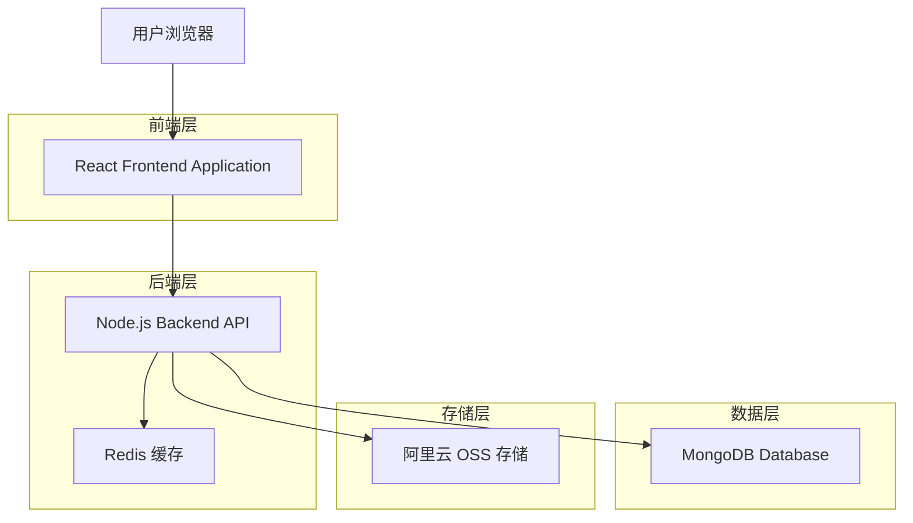
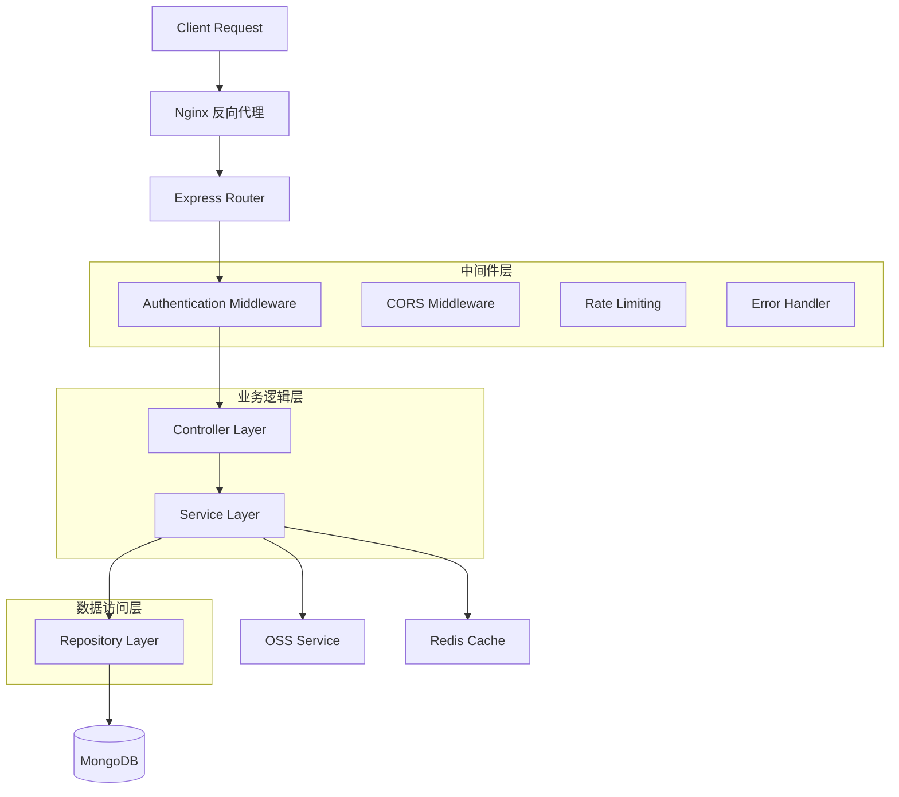
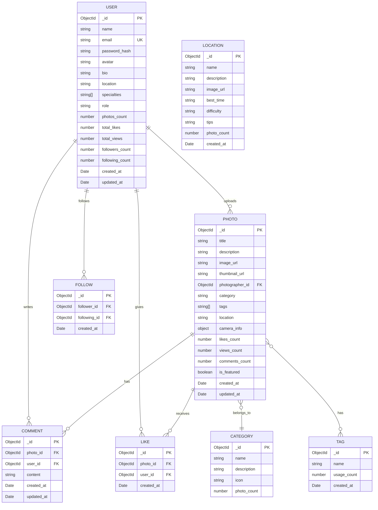

# 摄影交流平台技术架构文档

## 1. Architecture design



## 2. Technology Description

* **前端**: React\@18 + TypeScript + Tailwind CSS + Vite + Zustand

* **后端**: Node.js\@18 + Express\@4 + TypeScript + JWT认证

* **数据库**: MongoDB\@6 + Mongoose ODM

* **缓存**: Redis\@7 (会话管理、热点数据缓存)

* **文件存储**: 阿里云 OSS (图片存储和CDN加速)

* **部署**: Ubuntu 22.04 + PM2 + Nginx

## 3. Route definitions

| Route             | Purpose            |
| ----------------- | ------------------ |
| /                 | 首页，展示精选作品和摄影师推荐    |
| /login            | 登录页面，用户认证          |
| /register         | 注册页面，新用户注册         |
| /gallery          | 作品画廊，分类浏览所有作品      |
| /photo/:id        | 作品详情页，展示单个作品信息     |
| /photographer/:id | 摄影师主页，展示摄影师信息和作品   |
| /upload           | 作品上传页面，批量上传和编辑     |
| /profile          | 用户中心，个人资料和作品管理     |
| /following        | 关注动态页，查看关注摄影师的最新作品 |
| /locations        | 地点推荐页，拍摄地点信息       |
| /admin            | 管理后台，用户和内容管理       |

## 4. API definitions

### 4.1 Core API

#### 用户认证相关

**用户注册**

```
POST /api/auth/register
```

Request:

| Param Name  | Param Type | isRequired | Description |
| ----------- | ---------- | ---------- | ----------- |
| name        | string     | true       | 用户姓名        |
| email       | string     | true       | 邮箱地址        |
| password    | string     | true       | 密码          |
| specialties | string\[]  | false      | 摄影专长        |

Response:

| Param Name | Param Type | Description |
| ---------- | ---------- | ----------- |
| success    | boolean    | 注册是否成功      |
| message    | string     | 响应消息        |
| user       | User       | 用户信息        |
| token      | string     | JWT令牌       |

**用户登录**

```
POST /api/auth/login
```

Request:

| Param Name | Param Type | isRequired | Description |
| ---------- | ---------- | ---------- | ----------- |
| email      | string     | true       | 邮箱地址        |
| password   | string     | true       | 密码          |

Response:

| Param Name | Param Type | Description |
| ---------- | ---------- | ----------- |
| success    | boolean    | 登录是否成功      |
| message    | string     | 响应消息        |
| user       | User       | 用户信息        |
| token      | string     | JWT令牌       |

#### 作品管理相关

**获取作品列表**

```
GET /api/photos
```

Query Parameters:

| Param Name   | Param Type | isRequired | Description                 |
| ------------ | ---------- | ---------- | --------------------------- |
| page         | number     | false      | 页码，默认1                      |
| limit        | number     | false      | 每页数量，默认20                   |
| category     | string     | false      | 作品分类筛选                      |
| photographer | string     | false      | 摄影师ID筛选                     |
| sort         | string     | false      | 排序方式：latest, popular, views |

**上传作品**

```
POST /api/photos/upload
```

Request (multipart/form-data):

| Param Name | Param Type | isRequired | Description      |
| ---------- | ---------- | ---------- | ---------------- |
| images     | File\[]    | true       | 图片文件数组           |
| photosData | string     | true       | JSON字符串，包含作品信息数组 |

**获取作品详情**

```
GET /api/photos/:id
```

Response:

| Param Name   | Param Type | Description |
| ------------ | ---------- | ----------- |
| success      | boolean    | 请求是否成功      |
| photo        | Photo      | 作品详细信息      |
| photographer | User       | 摄影师信息       |
| comments     | Comment\[] | 评论列表        |

#### 用户互动相关

**点赞作品**

```
POST /api/photos/:id/like
```

**取消点赞**

```
DELETE /api/photos/:id/like
```

**添加评论**

```
POST /api/photos/:id/comments
```

Request:

| Param Name | Param Type | isRequired | Description |
| ---------- | ---------- | ---------- | ----------- |
| content    | string     | true       | 评论内容        |

**关注摄影师**

```
POST /api/users/:id/follow
```

**取消关注**

```
DELETE /api/users/:id/follow
```

#### 文件上传相关

**获取OSS上传签名**

```
POST /api/upload/signature
```

Request:

| Param Name  | Param Type | isRequired | Description |
| ----------- | ---------- | ---------- | ----------- |
| filename    | string     | true       | 文件名         |
| contentType | string     | true       | 文件类型        |

Response:

| Param Name     | Param Type | Description |
| -------------- | ---------- | ----------- |
| signature      | string     | OSS上传签名     |
| policy         | string     | 上传策略        |
| ossAccessKeyId | string     | OSS访问密钥ID   |
| host           | string     | 上传地址        |
| key            | string     | 文件存储路径      |

## 5. Server architecture diagram



## 6. Data model

### 6.1 Data model definition



### 6.2 Data Definition Language

**用户表 (users)**

```javascript
// MongoDB Schema Definition
const userSchema = new mongoose.Schema({
  name: {
    type: String,
    required: true,
    trim: true,
    maxlength: 50
  },
  email: {
    type: String,
    required: true,
    unique: true,
    lowercase: true,
    validate: [validator.isEmail, 'Invalid email']
  },
  password_hash: {
    type: String,
    required: true,
    minlength: 6
  },
  avatar: {
    type: String,
    default: ''
  },
  bio: {
    type: String,
    maxlength: 500,
    default: ''
  },
  location: {
    type: String,
    maxlength: 100,
    default: ''
  },
  specialties: [{
    type: String,
    enum: ['风光摄影', '人像摄影', '街拍纪实', '建筑摄影', '微距摄影', '野生动物', '黑白摄影', '夜景摄影', '旅行摄影', '其他']
  }],
  role: {
    type: String,
    enum: ['user', 'admin'],
    default: 'user'
  },
  photos_count: {
    type: Number,
    default: 0
  },
  total_likes: {
    type: Number,
    default: 0
  },
  total_views: {
    type: Number,
    default: 0
  },
  followers_count: {
    type: Number,
    default: 0
  },
  following_count: {
    type: Number,
    default: 0
  }
}, {
  timestamps: true
});

// 创建索引
userSchema.index({ email: 1 });
userSchema.index({ name: 1 });
userSchema.index({ created_at: -1 });
```

**作品表 (photos)**

```javascript
const photoSchema = new mongoose.Schema({
  title: {
    type: String,
    required: true,
    trim: true,
    maxlength: 100
  },
  description: {
    type: String,
    maxlength: 1000,
    default: ''
  },
  image_url: {
    type: String,
    required: true
  },
  thumbnail_url: {
    type: String,
    required: true
  },
  photographer_id: {
    type: mongoose.Schema.Types.ObjectId,
    ref: 'User',
    required: true
  },
  category: {
    type: String,
    required: true,
    enum: ['自然风光', '人像摄影', '街拍纪实', '建筑摄影', '微距摄影', '野生动物', '黑白摄影', '夜景摄影', '旅行摄影', '其他']
  },
  tags: [{
    type: String,
    maxlength: 20
  }],
  location: {
    type: String,
    maxlength: 100,
    default: ''
  },
  camera_info: {
    camera: { type: String, default: '' },
    lens: { type: String, default: '' },
    aperture: { type: String, default: '' },
    shutter: { type: String, default: '' },
    iso: { type: String, default: '' }
  },
  likes_count: {
    type: Number,
    default: 0
  },
  views_count: {
    type: Number,
    default: 0
  },
  comments_count: {
    type: Number,
    default: 0
  },
  is_featured: {
    type: Boolean,
    default: false
  }
}, {
  timestamps: true
});

// 创建索引
photoSchema.index({ photographer_id: 1 });
photoSchema.index({ category: 1 });
photoSchema.index({ tags: 1 });
photoSchema.index({ created_at: -1 });
photoSchema.index({ likes_count: -1 });
photoSchema.index({ views_count: -1 });
```

**评论表 (comments)**

```javascript
const commentSchema = new mongoose.Schema({
  photo_id: {
    type: mongoose.Schema.Types.ObjectId,
    ref: 'Photo',
    required: true
  },
  user_id: {
    type: mongoose.Schema.Types.ObjectId,
    ref: 'User',
    required: true
  },
  content: {
    type: String,
    required: true,
    trim: true,
    maxlength: 500
  }
}, {
  timestamps: true
});

// 创建索引
commentSchema.index({ photo_id: 1, created_at: -1 });
commentSchema.index({ user_id: 1 });
```

**点赞表 (likes)**

```javascript
const likeSchema = new mongoose.Schema({
  photo_id: {
    type: mongoose.Schema.Types.ObjectId,
    ref: 'Photo',
    required: true
  },
  user_id: {
    type: mongoose.Schema.Types.ObjectId,
    ref: 'User',
    required: true
  }
}, {
  timestamps: true
});

// 创建复合唯一索引
likeSchema.index({ photo_id: 1, user_id: 1 }, { unique: true });
```

**关注表 (follows)**

```javascript
const followSchema = new mongoose.Schema({
  follower_id: {
    type: mongoose.Schema.Types.ObjectId,
    ref: 'User',
    required: true
  },
  following_id: {
    type: mongoose.Schema.Types.ObjectId,
    ref: 'User',
    required: true
  }
}, {
  timestamps: true
});

// 创建复合唯一索引
followSchema.index({ follower_id: 1, following_id: 1 }, { unique: true });
followSchema.index({ following_id: 1 });
```

**地点表 (locations)**

```javascript
const locationSchema = new mongoose.Schema({
  name: {
    type: String,
    required: true,
    unique: true,
    trim: true
  },
  description: {
    type: String,
    required: true,
    maxlength: 1000
  },
  image_url: {
    type: String,
    required: true
  },
  best_time: {
    type: String,
    required: true
  },
  difficulty: {
    type: String,
    enum: ['简单', '中等', '困难'],
    required: true
  },
  tips: {
    type: String,
    maxlength: 500
  },
  photo_count: {
    type: Number,
    default: 0
  }
}, {
  timestamps: true
});

// 创建索引
locationSchema.index({ name: 1 });
locationSchema.index({ photo_count: -1 });
```

